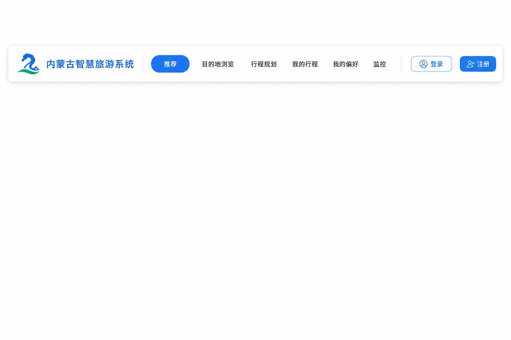
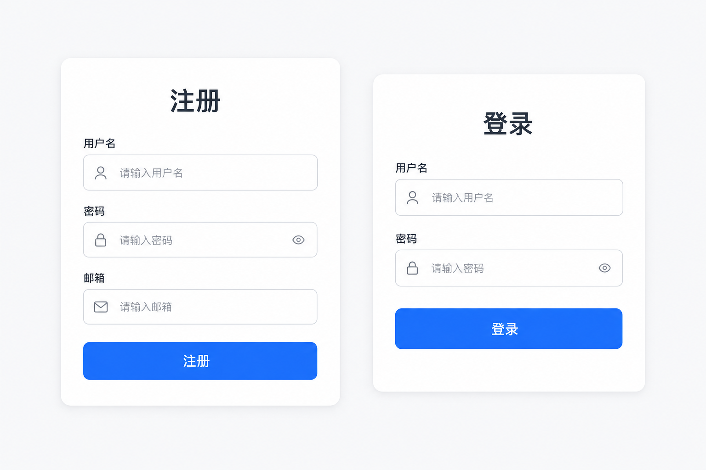
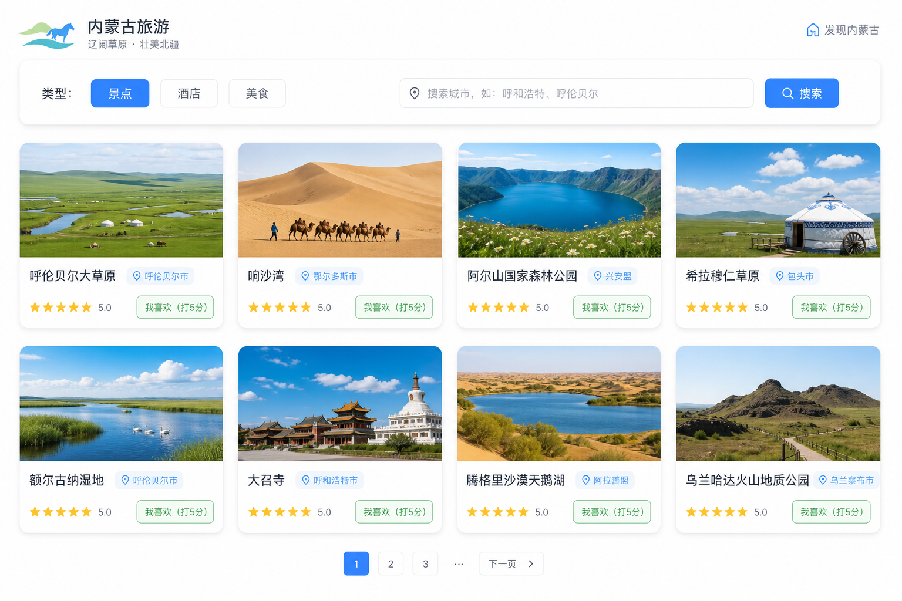
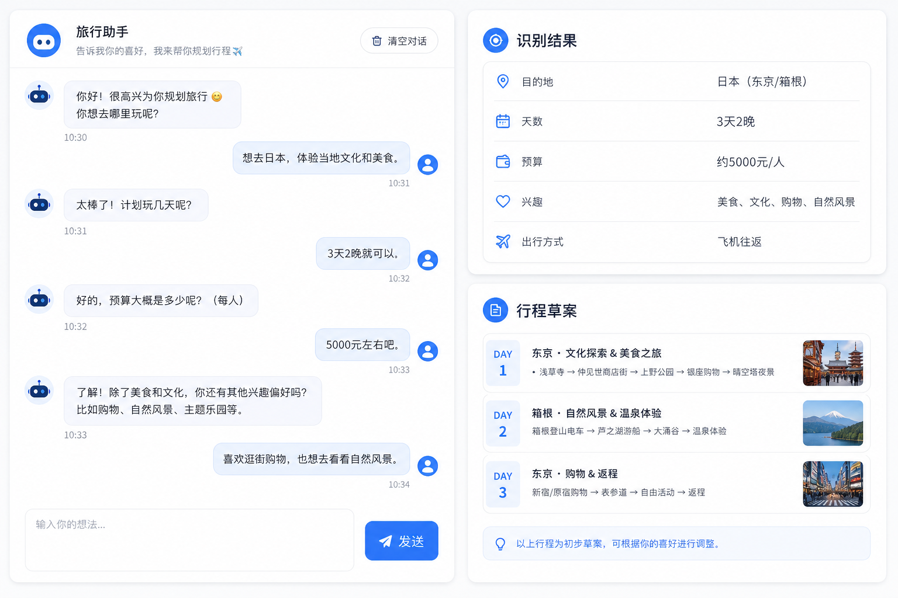
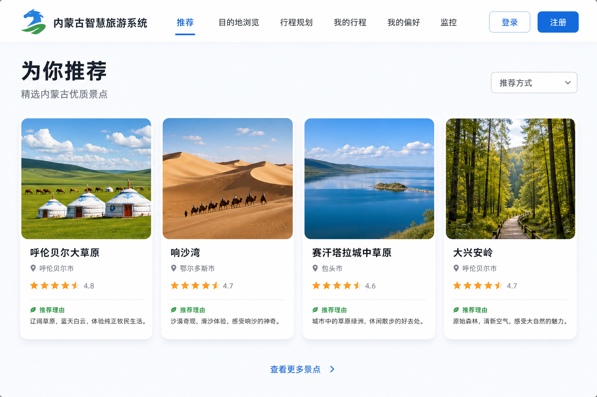
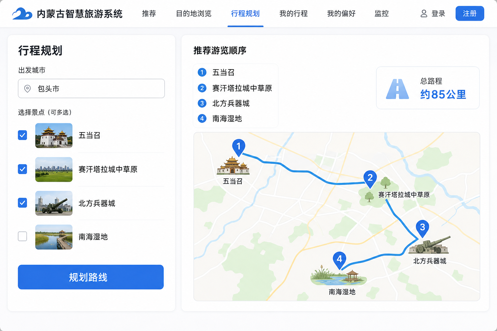
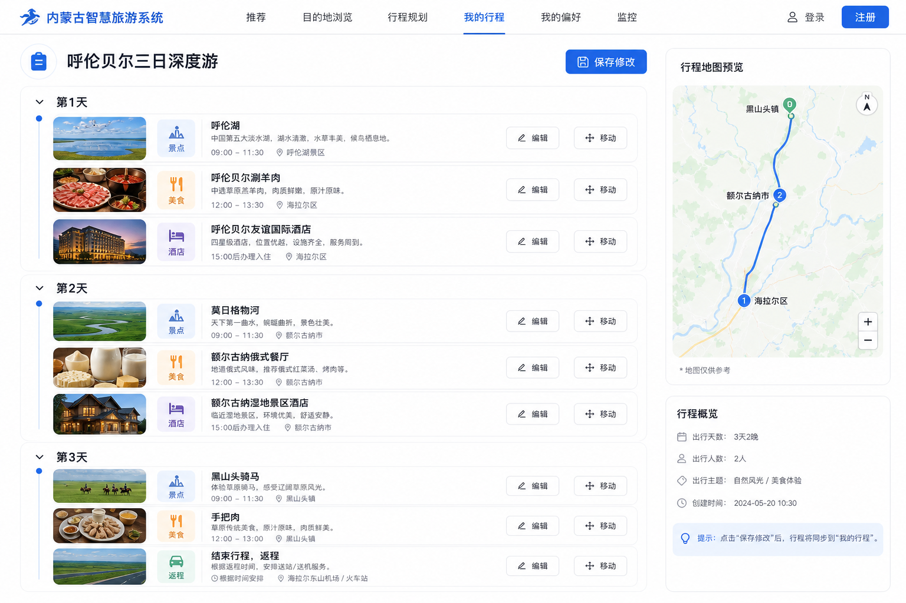

# 内蒙古智慧旅游系统 · 用户使用指南

| 项目 | 内容 |
|------|------|
| 文档名称 | 用户使用指南（面向最终用户的操作手册） |
| 文档版本 | v2.0 |
| 适用系统版本 | 内蒙古智慧旅游系统 · 原型交付版 |
| 读者对象 | 普通游客 / 系统使用者（无需任何技术基础） |
| 最后更新 | 2026-06-25 |

> 本指南依据《GB/T 19678.1 使用说明的编制》的结构与要求编写，按"你想完成的任务"组织内容。
> 文中示意图为界面**示意**，帮助你理解操作位置，实际界面以系统为准。

---

## 目录

- [前言](#前言)
- [账号与安全提示](#账号与安全提示)
- [快速上手（5 分钟）](#快速上手5-分钟)
- [认识页面导航](#认识页面导航)
- [操作指南](#操作指南)
  - [任务 1：注册并登录账号](#任务-1注册并登录账号)
  - [任务 2：浏览景点 / 酒店 / 美食并打分](#任务-2浏览景点--酒店--美食并打分)
  - [任务 3：用"我的偏好"对话获取行程草案](#任务-3用我的偏好对话获取行程草案)
  - [任务 4：查看首页个性化推荐](#任务-4查看首页个性化推荐)
  - [任务 5：查看相似景点](#任务-5查看相似景点)
  - [任务 6：规划一条游览路线](#任务-6规划一条游览路线)
  - [任务 7：保存与管理"我的行程"](#任务-7保存与管理我的行程)
- [故障排除](#故障排除)
- [术语小词典](#术语小词典)
- [联系与反馈](#联系与反馈)
- [更新记录](#更新记录)

---

## 前言

### 这个系统能帮你做什么

**内蒙古智慧旅游系统**帮助你发现内蒙古的好景点、好酒店、好美食，并提供：

- **个性化推荐**：你越用、越打分，推荐越懂你。
- **对话式规划**：像聊天一样说出你的想法，系统帮你出行程草案。
- **路线规划**：选好几个景点，系统帮你排顺序、估算路程。
- **行程管理**：把规划好的行程保存下来，随时查看和修改。

### 如何使用本指南

- 只想快速体验：直接看[快速上手（5 分钟）](#快速上手5-分钟)。
- 想完成某件具体的事：在[操作指南](#操作指南)里找到对应任务。
- 遇到问题：查看[故障排除](#故障排除)。

---

## 账号与安全提示

> ⚠️ **请留意以下几点，保护你的账号与数据安全：**

- **妥善保管密码**：密码至少 6 位，请勿告诉他人。
- **打分、保存行程等功能需要先登录**；未登录时可以浏览，但操作不会被保存。
- **共用电脑请记得退出登录**，避免他人使用你的账号。
- 系统不会向你索取与登录无关的敏感信息。

---

## 快速上手（5 分钟）

按这 4 步即可走通系统核心玩法：

1. **打开系统**：在浏览器访问系统首页地址（由管理员/老师提供，例如 `http://localhost:5173/`）。
2. **注册并登录**：点击右上角「注册」，填好用户名、密码后登录。
3. **说出你的想法**：进入「我的偏好」，输入一句话，例如
   `想自驾去呼和浩特玩3天，预算3000，亲子`，查看系统给出的行程草案。
4. **看推荐、做规划**：回到「推荐」首页看个性化景点；再到「行程规划」选几个景点生成路线。

完成以上 4 步，你已掌握系统的核心用法。下面是更详细的分任务说明。

---

## 认识页面导航

打开系统后，页面顶部是一排导航按钮，点击即可在各功能间切换。

| 导航 | 作用 |
|------|------|
| **推荐** | 首页，查看为你推荐的景点 |
| **目的地浏览** | 按城市/类型查找景点、酒店、美食，并可打分 |
| **行程规划** | 选择景点，生成游览顺序和路线 |
| **我的行程** | 查看、编辑、删除你保存的行程 |
| **我的偏好** | 用对话告诉系统你的出行喜好 |
| **监控** | 系统运行状态（一般给管理员看，普通用户可忽略） |
| **登录 / 注册** | 账号相关 |

---

## 操作指南

> 每个任务都按统一结构说明：**场景说明 → 操作前提 → 操作步骤 → 小贴士**。
> 操作步骤为"一步一动作"，并标注操作后你会看到的结果。

---

### 任务 1：注册并登录账号

**场景说明**：第一次使用系统时，先创建账号并登录，才能打分、保存行程、获得个性化推荐。

**操作前提**：无（任何人都可以注册）。

**操作步骤**：

1. 点击顶部导航的「注册」。→ 进入注册页面。
2. 输入**用户名**（至少 3 个字符）。
3. 输入**密码**（至少 6 个字符）。
4. （可选）输入**邮箱**。
5. 点击「注册」按钮。→ 看到"注册成功"提示。
6. 点击顶部「登录」，输入刚才的用户名和密码。
7. 点击「登录」按钮。→ 登录成功，可以开始使用全部功能。

**小贴士**：

- 如果提示"用户名已存在"，请换一个用户名。
- 登录后再进行打分和保存行程，操作才会被记录。

---

### 任务 2：浏览景点 / 酒店 / 美食并打分

**场景说明**：想看看内蒙古有哪些景点、酒店、美食，并把喜欢的标记出来，让推荐更懂你。

**操作前提**：打分需要**已登录**（仅浏览可不登录）。

**操作步骤**：

1. 点击顶部「目的地浏览」。→ 进入浏览页面。
2. 选择**类型**：景点 / 酒店 / 美食。
3. （可选）在城市框输入城市，例如"包头""呼伦贝尔"。
4. 点击「搜索」。→ 下方显示对应的卡片列表。
5. 在喜欢的景点卡片上点击「我喜欢（打 5 分）」。→ 看到"感谢你的评分"提示。

**小贴士**：

- 先给几个喜欢的景点打分，再回首页看推荐，效果立竿见影。
- 城市框留空时会展示更多城市的结果。

---

### 任务 3：用"我的偏好"对话获取行程草案

**场景说明**：不知道怎么安排？像聊天一样说出需求，系统帮你识别偏好并生成行程草案。

**操作前提**：可不登录预览；**登录后**才能把草案保存为行程、并记住你的偏好。

**操作步骤**：

1. 点击顶部「我的偏好」。→ 进入对话页面。
2. 在输入框用自然语言描述需求，例如
   `想自驾去呼和浩特玩3天，预算3000，亲子`。
3. 点击「发送」。→ 左侧出现助手回复。
4. 查看右侧「识别结果」卡片，确认目的地、天数、预算、兴趣、出行方式是否正确。
5. 当识别到目的地后，查看右侧「行程草案」预览。
6. （登录后，可选）在保存区填写标题，点击保存，把多日草案存为行程。

**小贴士**：

- 把描述写得更具体（城市 + 天数 + 预算 + 想玩什么），识别更准。
- 识别有偏差时，可展开"手动编辑"自行调整。

---

### 任务 4：查看首页个性化推荐

**场景说明**：在首页快速获取适合你的景点，并理解"为什么推荐它"。

**操作前提**：无；但**登录并打过分**后推荐会更贴合你。

**操作步骤**：

1. 点击顶部「推荐」。→ 进入首页，显示推荐景点。
2. 阅读每张卡片下方绿色的「推荐理由」，判断是否符合你的兴趣。
3. （可选）在右上角「推荐方式」下拉框选择不同方式：
   - **自动**：系统帮你决定，最省心；
   - **热门**：大家公认评分高、人气旺的景点；
   - **按偏好**：优先你喜欢的类型；
   - **猜你喜欢**：根据你和其他用户的打分，发现你可能感兴趣的新景点。
4. 切换方式后点击「刷新」。→ 推荐列表随之更新。

**小贴士**：

- 刚注册、还没打分时，系统会提示你先去打分或填写偏好——这叫"冷启动"，多用几次推荐就会变准。
- 常见的推荐理由：本站评分较高、OTA 平台评分优秀、社交媒体热度很高、符合你的偏好类型等。

---

### 任务 5：查看相似景点

**场景说明**：喜欢某个景点，想再找几个风格相近的。

**操作前提**：无。

**操作步骤**：

1. 在「目的地浏览」找到一个你感兴趣的景点卡片。
2. 点击卡片上的「查看相似景点」。→ 卡片下方展开一组相近景点。
3. 浏览这些相似景点的名称与评分，挑选感兴趣的继续了解。

**小贴士**：若该景点数据较少，可能暂无相似结果，换一个热门景点再试。

---

### 任务 6：规划一条游览路线

**场景说明**：选好几个想去的景点，让系统帮你排出合理的游览顺序并估算路程。

**操作前提**：所选城市需有景点数据；至少选择 **2 个**景点。

**操作步骤**：

1. 点击顶部「行程规划」。→ 进入规划页面。
2. 输入一个城市（如"包头"），加载该城市景点。
3. 勾选 **2–5 个**你想去的景点。
4. （可选）选择优化方式：最快路线 / 优化路线 / 综合（距离+热度）。
5. 点击「规划路线」。→ 右侧显示推荐游览顺序和估算总路程（公里）。

**小贴士**：

- 至少选 2 个景点才能规划；只选 1 个会提示补充。
- 若提示城市无景点，换一个城市，或先到浏览页确认有数据。

---

### 任务 7：保存与管理"我的行程"

**场景说明**：把规划好的行程存起来，日后随时查看、调整。

**操作前提**：**已登录**。

**操作步骤（保存）**：

1. 在「行程规划」生成路线后，在保存区填写标题，保存为**单日行程**；
   或在「我的偏好」生成的多日草案中，保存为**多日行程**。
2. 保存成功后，自动跳转到该行程的详情页。

**操作步骤（管理）**：

1. 点击顶部「我的行程」。→ 看到你保存的所有行程列表。
2. 点击某个行程进入详情页，可以：
   - 修改标题、日期、备注；
   - 在每一天增加/删除景点、餐饮、酒店条目；
   - 把某个条目「移到下一天」；
   - 从资源库「搜索并添加」新景点；
   - 对某天景点「重新计算最优顺序」并在地图上预览。
3. 修改后点击「保存修改」。→ 刷新后修改仍然保留。
4. 不需要的行程点击「删除行程」并二次确认。→ 该行程从列表移除。

**操作步骤（从零新建）**：

1. 在「我的行程」点击「新建空白行程」。
2. 填写标题、出发城市、可选出发日期、天数等，提交创建。→ 生成空白天数骨架。
3. 进入详情页，逐天添加内容并保存。

**小贴士**：行程可以反复编辑，不必一次定稿；保存后才会出现在列表中。

---

## 故障排除

> 按你看到的"现象"查找解决办法。

| 现象 | 可能原因 | 解决办法 |
|------|----------|----------|
| 点「打分」没反应或提示登录 | 未登录 | 先注册并登录，再打分 |
| 首页推荐不够"懂我" | 还没打分/没填偏好 | 去「目的地浏览」给喜欢的景点打分，或在「我的偏好」描述需求后刷新 |
| "我的偏好"识别不准 | 描述太笼统 | 写清城市、天数、预算、兴趣；或展开"手动编辑"调整 |
| 行程规划点了没结果 | 选的景点不足或城市无数据 | 至少选 2 个景点；确认所选城市有景点 |
| "我的行程"列表是空的 | 还没保存过行程 | 从「行程规划」或「我的偏好」先保存一个行程 |
| 相似景点为空 | 该景点数据较少 | 换一个更热门的景点再试 |
| 页面打不开/空白 | 系统未启动或地址错误 | 确认访问地址正确，并联系管理员确认系统在运行 |

> 仍未解决？请通过[联系与反馈](#联系与反馈)联系系统管理员。

---

## 术语小词典

| 术语 | 通俗解释 |
|------|----------|
| 推荐理由 | 系统说明"为什么推荐这个景点"的一句话 |
| 推荐方式（策略） | 系统挑选推荐内容的不同方式（自动/热门/按偏好/猜你喜欢） |
| 冷启动 | 你刚开始用、打分太少，系统还不太懂你的阶段 |
| 偏好 / 画像 | 系统记住的你的出行喜好（喜欢的类型、预算、风格等） |
| 行程草案 | 系统根据你的描述自动生成的初步行程安排 |
| 条目 | 行程中的一项内容（一个景点 / 一家餐厅 / 一家酒店） |
| OTA | 携程、美团等在线旅游平台 |

---

## 联系与反馈

- 使用中遇到问题，或对功能有建议，请联系**系统管理员 / 项目负责人**。
- 反馈时请尽量说明：你在**哪个页面**、做了**什么操作**、看到了**什么现象**，便于快速定位。

---

## 更新记录

| 版本 | 日期 | 说明 |
|------|------|------|
| v2.0 | 2026-06-25 | 按 GB/T 19678.1 规范重构为任务导向结构，新增前言/安全提示/术语表/反馈，配关键步骤示意图 |
| v1.0 | 2026-06-25 | 初版面向用户的操作指南 |

---

> 祝你在内蒙古玩得开心！更技术性的安装、部署与接口信息，请参阅交付文档《使用说明书》。
